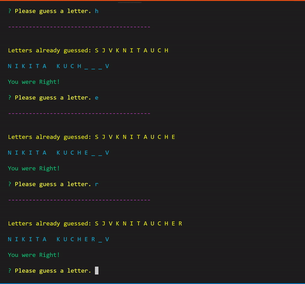
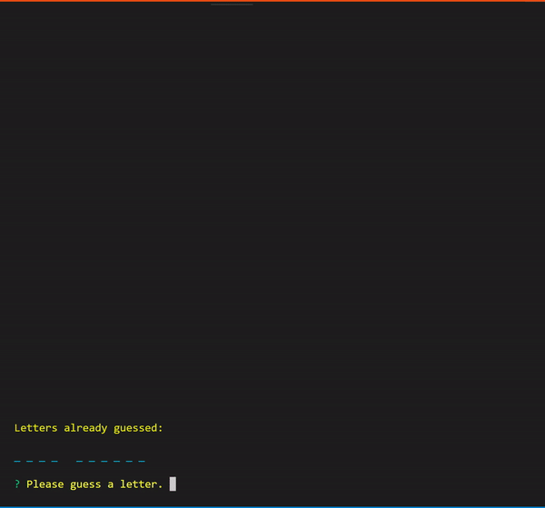

# Word Guess Command Line Edition!

## How to play

This game is a node application that is played in the command prompt.<br>
You will select a word group from the menu and from there, <br>
begin entering in letters one at a time to guess the hidden word/words<br>
After each round is over, you will be given a score and the ability to play again!

## How to get started

Navigate your way to the folder containing the files and bring up your command line.<br>
Then type in<br>
```
npm install
```
That will load in the modules used for this game, which are:<br>

- Inquirer
- Chalk

Now you are ready to Play!<br>

Type in 
```
node index.js
```
And you have started the game. Have fun!<br>

## Examples

Here are some gifs to show you what to expect:




